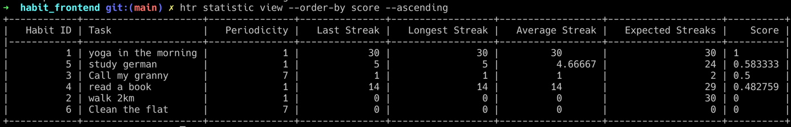

# Habit Tracker App

To keep track of certain habits or achieving personal goals, more and more
people rely on so called habit trackers to help them throughout the day.
If you check out any popular app store, you’ll find no shortage of habit
tracking applications in a wide range of quality and prices.

This project has a fully functional backend able to store and manage habits
and a fully functionally command line application to store and analyze habits.

The below screenshot is listening all the habits and ordering them by score
score ascending, giving a clear picture of the strongest and weakest habits:

# Backend

All the information about the backend are provided in [habit_backend/README.md](habit_backend/README.md)

# Frontend

All the information about the frontend are provided in [habit_frontend/README.md](habit_frontend/README.md)

